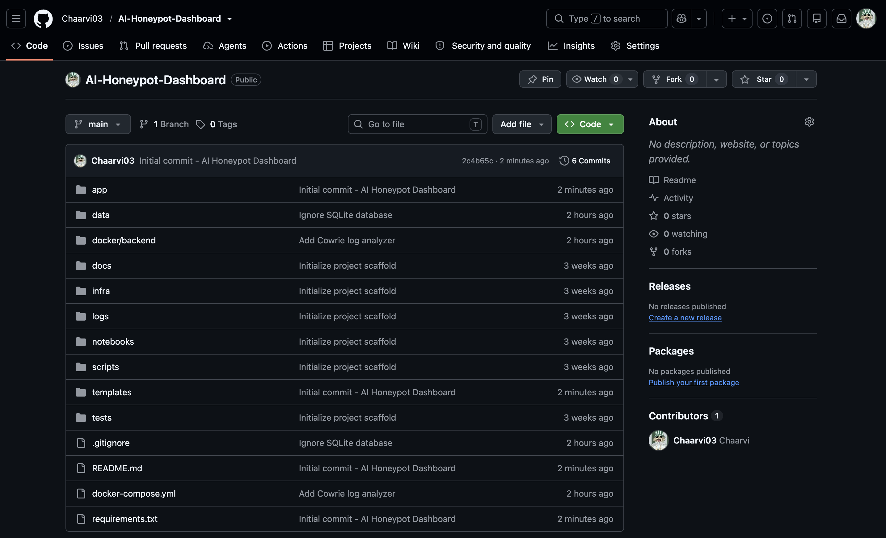
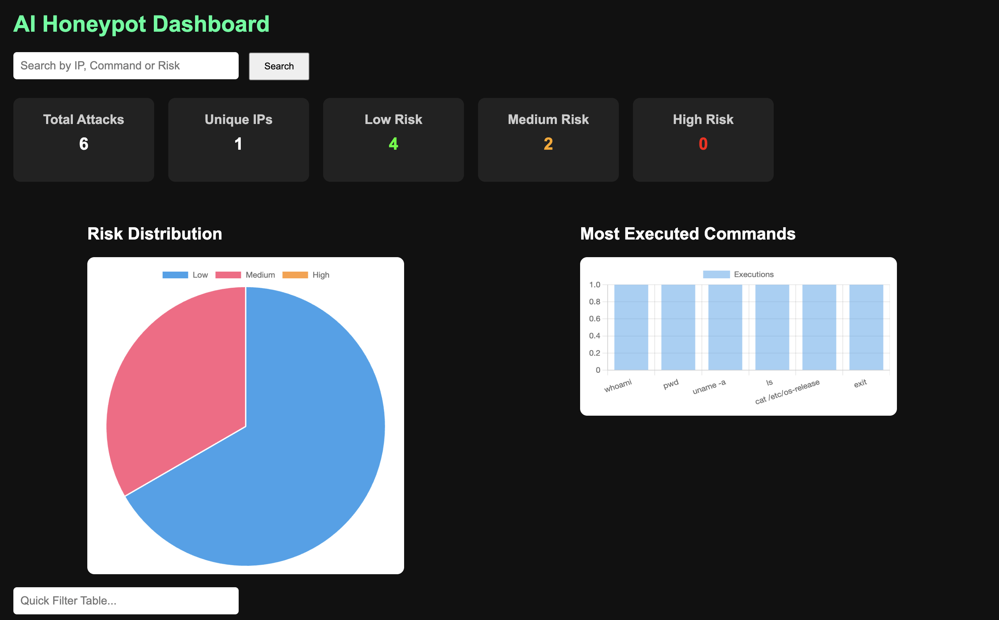
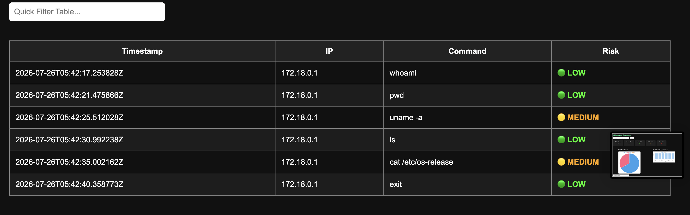

# 🛡️ AI Honeypot Dashboard

A Flask-based cybersecurity dashboard that visualizes attack data collected from a Cowrie SSH Honeypot. The project captures SSH attack logs, stores them in an SQLite database, classifies attacks based on executed commands, and presents real-time insights through an interactive web dashboard built with Flask.

---

# 📌 Project Overview

Cyber attackers frequently scan the internet for vulnerable SSH servers. This project deploys a **Cowrie SSH Honeypot** to simulate an SSH server and capture attacker activity.

The captured JSON logs are parsed using Python, stored in SQLite, and displayed through a Flask dashboard featuring statistics, search, filtering, and interactive charts.

---

# 🚀 Features

- 📡 Collects attack logs from Cowrie SSH Honeypot
- 🗄️ Stores parsed logs in SQLite
- ⚠️ Classifies commands into:
  - 🟢 Low Risk
  - 🟡 Medium Risk
  - 🔴 High Risk
- 📊 Dashboard Statistics
  - Total Attacks
  - Unique IP Addresses
  - Risk Summary
- 🥧 Risk Distribution Pie Chart
- 📈 Most Executed Commands Chart
- 🔍 Search by:
  - IP Address
  - Command
  - Risk Level
- ⚡ Quick Filter Table
- 🔄 Auto Refresh (every 5 seconds)
- 🌙 Dark Theme Dashboard

---

# 🛠️ Tech Stack

| Technology | Purpose |
|------------|---------|
| Python | Backend |
| Flask | Web Framework |
| SQLite | Database |
| HTML | Frontend |
| CSS | Styling |
| JavaScript | Client-side Logic |
| Chart.js | Charts & Visualisation |
| Cowrie Honeypot | SSH Attack Collection |
| Docker | Honeypot Deployment |

---

# 📂 Project Structure

```text
AI-Honeypot-Dashboard
│
├── app/
│   ├── api.py
│   ├── log_parser.py
│   └── log_to_db.py
│
├── templates/
│   └── index.html
│
├── data/
│   └── attacks.db
│
├── docker/
│   └── cowrie/
│
├── screenshots/
│   ├── dashboard.png
│   ├── mainpage.png
│   └── table.png
│
├── requirements.txt
├── docker-compose.yml
└── README.md
```

---

# 🏗️ System Architecture

```text
               Internet
                   │
                   ▼
         Cowrie SSH Honeypot
                   │
                   ▼
          Honeypot JSON Logs
                   │
                   ▼
           Python Log Parser
                   │
                   ▼
            SQLite Database
                   │
                   ▼
            Flask Backend API
                   │
                   ▼
        AI Honeypot Dashboard
```

---

# 📸 Screenshots

## Dashboard Overview



---

## Main Dashboard



---

## Attack Logs Table



---

# ⚠️ Threat Classification

## 🟢 Low Risk

- whoami
- pwd
- ls
- cat
- exit
- uname

## 🟡 Medium Risk

- wget
- curl
- chmod
- scp

## 🔴 High Risk

- bash
- python
- nc
- rm
- perl

---

# ⚙️ Installation

## Clone Repository

```bash
git clone https://github.com/Chaarvi03/AI-Honeypot-Dashboard.git
cd AI-Honeypot-Dashboard
```

## Create Virtual Environment

```bash
python3 -m venv .venv
```

### macOS / Linux

```bash
source .venv/bin/activate
```

### Windows

```bash
.venv\Scripts\activate
```

## Install Dependencies

```bash
pip install -r requirements.txt
```

## Run the Application

```bash
python app/api.py
```

Open your browser:

```
http://127.0.0.1:5000
```

---

# 📊 Dashboard Statistics

The dashboard displays:

- Total Attacks
- Unique Source IPs
- Low Risk Attacks
- Medium Risk Attacks
- High Risk Attacks
- Risk Distribution Chart
- Most Executed Commands

---

# 🔍 Search

Search attacks using:

- IP Address
- Command
- Risk Level

The table updates instantly with matching results.

---

# 🔄 Auto Refresh

The dashboard automatically refreshes every **5 seconds** to display newly captured attacks.

---

# 🎯 Future Improvements

- Machine Learning based threat detection
- Live WebSocket updates
- Geographic attack map
- User authentication
- Email alerts
- PDF report generation
- Elasticsearch integration
- Threat intelligence feeds

---

# 👨‍💻 Author

**Chaarvi Noolu**

Artificial Intelligence & Data Science Student

CMR Institute of Technology

---

# 📜 License

This project is developed for educational and cybersecurity learning purposes.